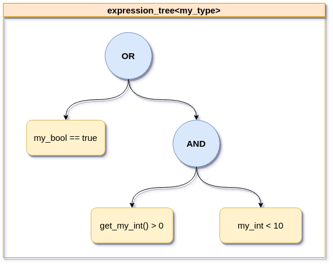

# Cpp Expression Tree

Cpp Expression Tree is a header-only, C++14 library for creating logical expression trees and using them to evaluate instances of user-defined data types. 

Inspired by m-peko/booleval.

This project is under development and is subject to change. Project contributions and issue reports are welcome. The more the merrier! 
( ... well, maybe not so much for bug reports)


## Table of Contents

* [A Quick Example](#a-quick-example)
* [Creating Expression Trees](#creating-expression-trees)
* [Types of Expression Tree Nodes](#types-of-expression-tree-nodes)
    * [Expression Tree Leaf Nodes](#expression-tree-leaf-nodes)
    * [Expression Tree Op Nodes](#expression-tree-op-nodes)
* [Logical Operators](#logical-operators)
* [Boolean Operators](#boolean-operators)
* [Using this Library](#using-this-library)
* [Compiling](#compiling)
    * [Running the Unit Tests](#running-the-unit-tests)


## A Quick Example

```cpp
#include <attwoodn/expression_tree.hpp>

using namespace attwoodn::expression_tree;

// imagine there is some user-defined type, like so
struct my_type {
    int my_int;
    bool my_bool;

    int get_my_int() const {
        return my_int;      
    }
};

...

// the Cpp Expression Tree library can be used to create an expression tree to 
// evaluate instances of my_type

// create an expression tree: my_bool == true OR (get_my_int() > 0 AND my_int < 10)
expression_tree<my_type> expr {
    make_expr(&my_type::my_bool, op::equals, true)
    ->OR((make_expr(&my_type::get_my_int, op::greater_than, 0)
        ->AND(make_expr(&my_type::my_int, op::less_than, 10))
        )
    )
};


// create an instance of my_type that satisfies the above expression
my_type obj;
obj.my_bool = true;
obj.my_int = 4;
assert(expr.evaluate(obj));   // returns true - obj matches the expression


// update obj so that my_int is outside the range 1..9
obj.my_bool = true;
obj.my_int = 12;
assert(expr.evaluate(obj));   // returns true - obj matches the expression


// update obj so that my_bool is false and my_int is outside the range 1..9
obj.my_bool = false;
obj.my_int = 0;
assert(!expr.evaluate(obj));  // returns false - obj does not match the expression
```

Below is a diagram showing the content of the `expression_tree<my_type>` created in the example code above:

<p align="center">
    
</p>

As you can imagine, this example code can be expanded to fit a variety of use cases and user-defined types. More complex code examples are provided in the documentation below. Further, there are a number of unit tests located in the `tests` directory, which may be helpful for getting familiar with the library.


## Creating Expression Trees

The `expression_tree` class is a templated, RAII container class that takes ownership of user-defined expressions. Instances of `expression_tree` can be moved and/or copied to different contexts while maintaining consistency and memory safety. The template parameter of `expression_tree` defines the type of object that the `expression_tree` will evaluate. Assuming there is a user-defined struct named `my_type`, the templated `expression_tree` type would look like this: `expression_tree<my_type>`. The template argument of `expression_tree` cannot be a primitive type, like `int`, `char`, or `double`.

An `expression_tree` cannot be default constructed - it must be initialized with an expression. Users can easily and intuitively define expressions using one of the `make_expr` helper functions found in the namespace `attwoodn::expression_tree`. `make_expr` generates heap-allocated pointers to expression tree nodes and returns them. As such, the returned expression tree node pointers should be managed carefully. If the returned pointers are not wrapped in an `expression_tree` or a smart pointer, they will need to be explicitly deleted by the calling code. 

Here are some examples of how a user may safely handle the return value from one of the `make_expr` helper functions:
```cpp
#include <attwoodn/expression_tree.hpp>

using namespace attwoodn::expression_tree;

// let's bring back the same implementation of my_type as shown above
struct my_type {
    int my_int;
    bool my_bool;

    int get_my_int() const {
        return my_int;      
    }
};


...


// The heap-allocated expression node pointer returned by make_expr becomes owned by the expression_tree
expression_tree<my_type> expr_tree_raw {
    make_expr(&my_type::my_bool, op::equals, true)
};
 

...


// The heap-allocated expression node pointer returned by make_expr becomes owned by the unique_ptr
std::unique_ptr<node::expression_tree_node<my_type>> smart_expr {
    make_expr(&my_type::my_bool, op::equals, true)
};

// the expression_tree takes ownership of the unique_ptr
expression_tree<my_type> expr_tree_smart(std::move(smart_expr));


...


// The heap-allocated expression node pointer returned by make_expr must be explicitly deleted
auto* expr_raw = make_expr(&my_type::my_bool, op::equals, true);
delete expr_raw;
```

The `make_expr` helper function is templated and overloaded to allow for maximum compatibility for use within expressions. There are three definitions of `make_expr`:
 * One that accepts a reference to a value-type class member variable, an operator function, and a comparison value (whose type matches the given class member variable);
 * One that accepts a reference to a pointer-type class member variable, an operator function, and a pointer to a comparison value (whose type matches the given class member variable); and
 * One that accepts a reference to a const class member function, an operator function, and a comparison value (whose type matches the return type of the given const class member function)
 

Please see the section below for more information about expression tree nodes.


## Types of Expression Tree Nodes

There are two types of expression tree nodes: leaf nodes and op nodes. 

### Expression Tree Leaf Nodes

Expression tree leaf nodes contain individual, actionable expressions against which a class/struct instance is evaluated. Expression tree leaf nodes are only ever found at the extremities of the expression tree.

### Expression Tree Op Nodes

Expression tree op nodes contain a boolean operation (AND/OR) and have references to a left child node and a right child node. The child nodes may be expression tree leaf nodes, expression tree op nodes, or a permutation of the two. Expression tree op nodes are only ever found in the inner part of the tree. An expression tree op node is always a parent node and it always has two child nodes.


## Logical Operators

There are several logical operator functions defined in the namespace `attwoodn::expression_tree::op` that can be used to create expression tree leaf nodes. The included operators are:
 * equals
 * not_equals
 * less_than
 * greater_than

Each of the above logical operator functions are templated, and are overloaded to permit passing arguments of either a `const T&` type, or a `T*` type. This means that value types, references, and pointers are all permissible for comparison. 

Note that there is a known limitation to comparing `T*` types, such as `char*`, using the above operator functions. With `T*` types, no iteration is performed, so comparison is performed only on the data located at the beginning of the pointer address. For example:

```cpp
assert(op::equals("test", "testing 123"));                            // returns true

assert(!op::equals(std::string("test"), std::string("testing 123"))); // returns false
```

Should users wish to compare an iterable collection of elements using the provided operator functions, they should compare container types, such as `std::vector<T>`, instead of pointer types like `T*`.

Users of the library can also easily define their own logical operators and use them when creating expressions. Here is an example of how a user might create their own operator functions and use them in an expression:

```cpp
#include <attwoodn/expression_tree.hpp>

using namespace attwoodn::expression_tree;

// imagine there are two user-defined types, like so:
struct packet_payload {
    uint16_t error_code; 
    std::string data;
    bool checksum_ok;

    uint64_t payload_size() const {
        return data.size();
    }
};

// data packet contains an instance of packet_payload, which needs to be evaluated
class data_packet {
    public:
        std::string sender_name;
        packet_payload payload;
};


...


// user creates their own logical operator for evaluating incoming packet_payload objects.
// only the first function argument is used. The other is an "empty", ignored instance
auto is_small_packet_payload = [](const packet_payload& incoming, const packet_payload&) -> bool {
    if(incoming.error_code == 0 && incoming.checksum_ok && incoming.payload_size() <= 10) {
        return true;
    }
    return false;
};

// User creates an expression that only accepts small, non-errored data packets from Jim. 
// The expression evaluates the packet_payload using the user-defined lambda operator created above
expression_tree<data_packet> expr {
    make_expr(&data_packet::sender_name, op::equals, std::string("Jim"))
    ->AND(make_expr(&data_packet::payload, is_small_packet_payload, packet_payload()))
};

data_packet incoming_packet;

// Jim sends a small, non-errored data packet
incoming_packet.sender_name = "Jim";
incoming_packet.payload.checksum_ok = true;
incoming_packet.payload.data = "hello!";
incoming_packet.payload.error_code = 0;
assert(expr.evaluate(incoming_packet));    // passes evaluation

// Pam sends the same packet payload
incoming_packet.sender_name = "Pam";
assert(!expr.evaluate(incoming_packet));   // fails evaluation. No packets from Pam are accepted (sorry)

// Jim sends a packet with a bad checksum
incoming_packet.sender_name = "Jim";
incoming_packet.payload.checksum_ok = false;
assert(!expr.evaluate(incoming_packet));   // fails evaluation. Packet was from Jim, but checksum failed

// Jim sends a packet whose payload is too big
incoming_packet.payload.checksum_ok = true;
incoming_packet.payload.data = "Boy do I have a long story for you - so I was talking to Pam ...";
assert(!expr.evaluate(incoming_packet));   // fails evaluation. Payload was too big. Give me the TLDR, Jim

// Jim sends a small, rude packet
incoming_packet.payload.data = "Dwight sux";
assert(expr.evaluate(incoming_packet));    // passes evaluation. The payload was the right size this time

// Jim sends a packet has an error code
incoming_packet.payload.error_code = 404;
assert(!expr.evaluate(incoming_packet));   // fails evaluation. The payload had an error code
```

## Boolean Operators

Boolean operators are used to chain individual expression tree nodes together. There are two boolean operators that can be used: `AND` and `OR`. These boolean operators are accessible via function calls on the expression nodes. Calling these functions generates a new expression tree node which becomes the parent of the nodes on either side of the boolean operator

A complex expression tree can be created by calling these functions to chain multiple expression tree nodes together.


## Using this Library

To include this library in your project, simply copy the content of the `include` directory into the `include` directory of your project. That's it! Now where did I put that Staples "Easy" button...?


## Compiling

This project uses the CMake build system. The minimum CMake version is set to 3.10.

First, clone the git repository and navigate into the local copy. Once you're there, run the following commands:

```
mkdir build && cd build
cmake ..
make
```

### Running the Unit Tests

After cloning and compiling the project, navigate to the build directory that was created. Enable the `BUILD_TESTING` CMake flag if it is not already enabled. My preferred tool for setting CMake flags via the command line is `ccmake`. Simply run `ccmake ..` in the build directory to get a command line UI for modifying CMake project flags. There, you can enable or disable the `BUILD_TESTING` flag, or set the build type from Release to Debug.

With the `BUILD_TESTING` flag enabled, run the following command in the build directory:

```
ctest .
```

CTest will execute the unit tests and provide a pass/fail indication for each one. 

The address sanitizer is enabled on every unit test executable. A test will fail should memory leak during test execution.